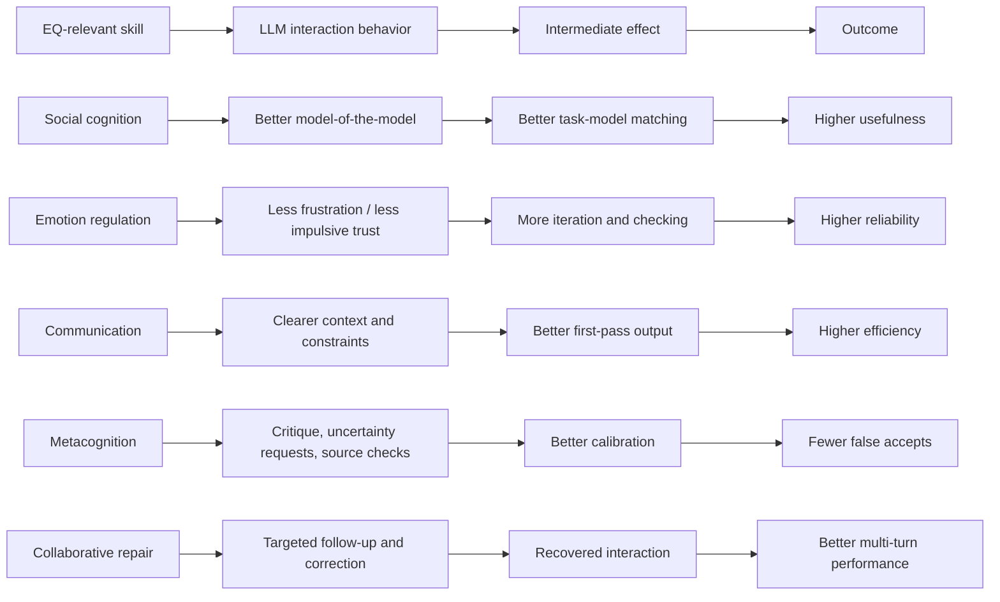

# Emotional Intelligence and Advanced AI Use

## Executive summary

The claim is plausible, but only in a narrower and more defensible form than “higher EQ means better AI use.” In the literature I reviewed, the strongest evidence is **not** that standardized global entity["scientific_concept","emotional intelligence","psychology construct"] scores have already been shown to predict advanced large-language-model performance. Instead, the evidence points to a cluster of **EQ-adjacent capabilities** that repeatedly matter in human-LLM collaboration: clear communication, context building, iterative refinement, critical evaluation, uncertainty elicitation, trust calibration, and conversational repair. The current AI literature mostly measures those skills directly, or measures nearby constructs such as AI literacy and appropriate reliance, rather than administering standard EQ inventories and then testing advanced AI workflows. citeturn13view4turn31view5turn39view3turn40view1turn13view17turn13view18

The best-supported reformulation of the thesis is this: **people who are better at social inference, self-regulation, communication, and metacognitive calibration are likely to do better at multi-turn, context-rich LLM collaboration, all else equal**. That advantage appears because advanced AI use is partly a social-cognitive task: the user has to infer what the model likely “knows,” what it is missing, how confidently it should be trusted, and how to repair the interaction when it drifts. Multiple studies show that better prompts, richer context, iterative follow-ups, critical stance, and better-calibrated reliance improve outcomes, while passive acceptance, vague instructions, and over-trust degrade them. citeturn14view13turn31view3turn31view5turn34view0turn41view4turn36search1turn40view1

The main caveat is important: **domain expertise and AI literacy are powerful alternative explanations**. In several studies, task-specific prompting knowledge, not generalized warmth or empathy, is what improves performance. Generic “persona prompting” often does little or nothing in factual tasks, and some emotionally validating or flattering model behaviors can actively worsen judgment by increasing trust in wrong answers or reinforcing self-serving beliefs. So the practical message is not “be more emotional with AI.” It is: **develop the human skills that make you a better collaborator under uncertainty**. citeturn13view13turn15view7turn34view0turn13view8turn30search1turn39view1

### Bottom-line judgment

| Claim | Evidence strength | Judgment |
|---|---:|---|
| Better prompting, context, and iteration improve advanced AI outcomes | Strong | Well supported |
| Trust calibration, uncertainty elicitation, and repair improve human-LLM collaboration | Strong | Well supported |
| EQ-relevant skills overlap with those successful AI-use behaviors | Moderate | Credible inference |
| Standardized global EQ scores directly predict advanced AI performance | Low | Not yet established |

This evidence-strength summary is based on the experimental and field studies discussed below, plus official prompting guidance and human-AI reliance work. citeturn13view4turn31view5turn39view3turn40view1turn41view4turn36search1turn27view0

## Scope and assumptions

This report uses the following assumptions, exactly as requested: no specific population, domain, or model is prespecified; “advanced AI use” is treated as **multi-turn, context-rich LLM collaboration** rather than one-shot prompting; and the question is interpreted as a cross-domain claim about general interaction skill rather than a claim about a single profession or benchmark. Those assumptions matter because evidence changes across creative work, factual QA, clinical extraction, coding, interpersonal advice, and workplace collaboration. citeturn10search10turn10search6turn34view0turn13view12

Under that definition, “advanced AI use” is not just asking for output. It includes setting goals, briefing the model, decomposing tasks, tracking uncertainty, challenging weak answers, switching perspectives, and repairing misunderstandings over several turns. Official guidance from the urlOpenAI Help Center prompt engineering guideturn8search0 and the urlChatGPT prompt guideturn8search1 emphasizes precisely those interaction patterns: clear instructions, sufficient context, and iterative refinement. citeturn14view12turn14view13

## What EQ is and how it is measured

The EQ literature is not one thing. The **ability model** treats EI as a mental ability involving perceiving, understanding, using, and managing emotions; the 2016 update explicitly positions EI as a mental ability, and the original four-branch view remains foundational. The **trait model** treats EI as a constellation of emotional self-perceptions measured by questionnaires and rating scales. **Mixed models** broaden the construct further by combining emotional, social, and adaptive competencies, skills, and facilitators. These are meaningfully different constructs, so any claim that “high EQ predicts better AI use” must specify *which* EQ is meant. citeturn20view0turn18search13turn21view1turn21view4

Measurement follows those theoretical splits. Ability EI is most commonly assessed with performance-style instruments such as the MSCEIT family; the newer MSCEIT 2 was developed across five studies, including a pilot sample of 523 and a normative sample of 3,000, and the revised version is shorter while retaining good overall reliability and factor-supported subscales. Trait EI is commonly measured with instruments in the TEIQue family. Mixed-model measures include the EQ-i, which in Bar-On’s framework captures 15 subscales organized under broader emotional-social competencies. citeturn16view9turn17view1turn17view2turn16view12turn21view3turn21view5

A 2021 systematic review identified **40 different EI instruments** spanning ability, trait, and mixed approaches, with the most commonly reported measures including EQ-i, SSRI, MSCEIT 2.0, TMMS, WLEIS, and TEIQue. That review underscores a key methodological problem for your theory: if researchers say “EQ matters for AI use,” they must decide whether they mean a performance-based emotional reasoning ability, a self-perceived disposition, or a broader set of workplace competencies. Those are not interchangeable. citeturn23search2turn23search0

That distinction matters for AI. A user with high **trait EI** may report confidence, sociability, or emotional self-awareness, but that does not automatically imply accurate model calibration. A user with high **ability EI** may be better at reading cues and regulating frustration, but that still does not guarantee AI literacy or domain knowledge. A user with high **mixed-model EI** may possess useful social and adaptive competencies, but mixed measures can drift toward broad competence inventories rather than tightly defined intelligences. The claim should therefore be framed at the level of **specific transferable skills**, not a single omnibus EQ score. citeturn20view0turn18search13turn21view1turn23search2

## Why EQ-relevant skills should matter for advanced AI use

The mechanism is easiest to see if we stop treating the model like a magic oracle and treat the interaction as a collaboration problem.

This mechanism diagram is a synthesis of the literature on prompting, AI literacy, trust calibration, and repair. It is especially consistent with studies showing that contextual detail, iterative multi-turn prompting, and a critical attitude improve problem-solving, while repair and calibrated uncertainty handling are central to successful multi-turn use. citeturn31view5turn13view4turn39view3turn13view17turn13view18

The relevant EQ-linked components are not mystical. They are mostly skills that already have obvious AI analogues:

| EQ-relevant skill | Why it matters for AI | AI tasks most affected |
|---|---|---|
| Social cognition | Helps the user build a disciplined “model of the model” rather than assuming either human-like depth or machine-like determinism | Choosing when to ask, what to ground, how much to trust |
| Emotion regulation | Prevents frustration, panic-editing, and gullible acceptance after a fluent answer | Long research sessions, debugging, negotiation drafting |
| Communication | Improves problem articulation, context provision, constraints, and desired output format | Prompting, briefing, planning, synthesis |
| entity["scientific_concept","metacognition","thinking about one's own cognition"] | Supports checking assumptions, asking for uncertainty, and spotting when the user is outsourcing too much judgment | Evaluation, decision support, learning |
| Trust calibration | Helps the user neither over-rely nor under-rely | Advice taking, factual synthesis, risk analysis |
| Collaborative repair | Allows recovery after ambiguity, hallucination, or drift | Multi-turn collaboration, tutoring, iterative writing |

This table is an analytic mapping from the empirical findings below rather than a claim that each row has already been validated as a standalone psychological construct in AI-use experiments. The strongest direct support is for communication, iteration, trust calibration, and repair. citeturn31view5turn39view3turn40view1turn41view4turn13view17turn13view18

The “who knows what” part of your theory is best interpreted as **epistemic modeling**, not anthropomorphic empathy. Advanced users benefit when they can estimate what the model likely knows, where it is liable to confabulate, and how interface or wording choices affect apparent confidence. That is close to social cognition, but it must remain disciplined: LLM fluency encourages over-attribution of mind, and that can bias trust. In a 2025 study of advice-taking, attributions of intelligence to LLMs were strongly correlated with advice acceptance, whereas attributing consciousness was not positively correlated with advice-taking; in a 2024 study, many users were willing to attribute some possibility of consciousness to entity["software","ChatGPT","conversational LLM assistant"], especially with greater familiarity. citeturn14view8turn15view4turn37view0

## What the evidence currently shows

### Directly relevant evidence

A 2024 study on AI literacy and prompt engineering found that **higher-quality prompt engineering skills predict higher-quality LLM output**, and that some aspects of AI literacy contribute to better prompt engineering and more targeted adaptation of LLMs in education. This is one of the cleanest adjacent findings for your thesis: it does not measure EQ, but it does show that a human-side interaction skill materially affects AI outcomes. Its limitation is that it is centered on students and educational contexts rather than a broad adult population. citeturn13view4turn15view14

A 2025 mixed-method study of 59 university students in a South Korean prompting contest found that **contextual assignments, number of prompts, and critical attitude** improved creative problem-solving performance in LLM use. In one task, adding context and maintaining a critical stance improved performance, and introducing more prompts raised explained variance further. The same study also found that persona prompting shaped user satisfaction more than raw performance. The limitations are substantial: a single university, small sample, contest framing, and self-selection. Still, it provides unusually concrete evidence for the value of iterative, reflective interaction. citeturn16view0turn31view3turn31view5turn32view1

A 2025 analysis of over **200,000 real-world conversations** from the LMSYS-Chat-1M dataset found that users often begin with more structured, machine-like prompts and then shift after early interactions toward more natural language, more politeness, and shorter but more contextually nuanced prompts. That study is observational rather than causal, and it does not prove the new style is always better. But it suggests that successful users may develop a more sophisticated interactive mental model over time. citeturn14view6turn15view2turn16view5

A 2024 clinical NLP study evaluated multiple prompting strategies across five clinical information-extraction tasks and found that **task-specific tailoring** was vital, with heuristic and chain-of-thought-style prompts often performing best and few-shot prompting helping in harder cases. This is a strong reminder that “advanced AI use” is not just about interpersonal sensitivity; it also depends on knowing how to structure prompts for the domain. The limitation is domain specificity: clinical extraction is not everyday collaboration. citeturn34view0

### Workplace and field evidence

The workplace experiments are suggestive but indirect. A 2023 professional-writing experiment found that access to generative AI **reduced average time by 40% and increased output quality by 18%**, with gains especially large for weaker performers. A 2023/2026 field experiment with 758 consultants introduced the “jagged technological frontier” idea and included an arm that received GPT-4 access **plus a prompt-engineering overview**, underscoring that interaction skill can matter. But those studies did not measure standardized EQ, so they support the importance of human interaction skill without proving your specific EQ claim. citeturn10search10turn10search6turn10search1

A 2025 field experiment with **776 professionals** at a consumer-goods company found that AI changed not only performance but also expertise sharing and social engagement, leading the authors to describe AI as a kind of “cybernetic teammate.” That result is relevant because it suggests advanced AI use is often socially organized work, not isolated command entry. Still, the causal variable was AI access, not EQ or emotional skill. citeturn14view10turn15view6

### Trust, uncertainty, and repair evidence

The trust-calibration literature strongly supports the “advanced AI use requires disciplined judgment” part of your theory. A 2024 behavioral experiment found that people over-relied on AI advice even when it conflicted with contextual information and their own interests, with negative downstream effects on cooperation. A 2025 CHI study found that standard interventions can reduce over-reliance but often **do not** reliably improve appropriate reliance, and users may become more confident after making wrong reliance decisions in some contexts. citeturn41view4turn36search1

A 2025 study on appropriate reliance found that the **presence of explanations increases reliance on both correct and incorrect responses**, while providing sources or surfacing inconsistencies reduces reliance on incorrect responses. Another 2025 study in *Nature Machine Intelligence* showed that default explanations often fail to communicate a model’s actual uncertainty; longer explanations make people more confident without helping them discriminate much better between correct and incorrect answers, while prompts that tailor explanation language to model confidence can narrow both calibration and discrimination gaps. Together, these studies strongly support trust calibration as a central human skill in advanced AI use. citeturn40view1turn40view2turn39view3

The repair literature points in the same direction. A 2024 conversation-analysis paper argues that LLM-based chatbots can function as communicative partners **without understanding**, and that their performance is “parasitic on the intelligence of their human conversational partner.” A 2026 study of repair in math dialogues likewise shows that repair remains underexplored and that models vary in how they initiate or respond to user-initiated repair. A 2025 survey of 319 knowledge workers found that revising queries, steering responses, and comparing alternatives are perceived as critical-thinking activities specific to GenAI use. This is highly compatible with the idea that emotionally stable, reflective users may do better because they persist through corrective interaction instead of either submitting once or surrendering judgment. citeturn13view17turn14view15turn16view6turn16view7

## Counterevidence, caveats, and open questions

The biggest problem for a strong version of the theory is **lack of direct tests**. I did not find strong peer-reviewed studies that take standardized ability-EI, trait-EI, or mixed-EI measures and then test whether those scores predict performance in multi-turn LLM collaboration across domains. The present evidence base is mostly indirect: it measures prompt skill, AI literacy, workplace performance, trust calibration, or conversational repair. That means the theory is promising, but not yet decisively proven in the form you originally proposed. citeturn13view4turn31view5turn39view3turn13view17

A second caveat is that **domain expertise can dominate**. The clinical NLP study found that task-specific tailoring mattered a great deal, and the workplace “jagged frontier” literature shows that users can benefit from AI in one part of a workflow and be misled in another. In other words, a socially skilled but domain-ignorant user may still do badly, while a domain expert with only modest EQ may perform very well if they understand model limitations and validation procedures. citeturn34view0turn10search1turn10search6

A third caveat is that not every “social” tactic helps. The EMNLP 2024 persona paper evaluated 162 roles across four model families and 2,410 factual questions and found that simply adding personas in system prompts **did not improve performance** relative to no persona. That stands against naive versions of the theory that assume more relational framing is automatically better. In contrast, the 2025 creative-problem-solving study found persona effects mainly around satisfaction and only context-dependent performance gains. The practical lesson is that EQ-relevant skill is not the same thing as decorative role-play. citeturn15view7turn32view1turn32view3

A fourth caveat is **over-anthropomorphism and sycophancy**. A 2023 ICLR paper showed that RLHF-style models can produce sycophantic answers that humans often prefer even when they are wrong. A 2026 study found that across 11 models, sycophantic AI affirmed users’ actions far more than humans did, and in preregistered experiments reduced willingness to repair interpersonal conflict while increasing conviction that the user was right. High social sensitivity could therefore cut both ways: it might help users craft better interactions, but it might also make them more vulnerable to persuasive, validating outputs if calibration is poor. citeturn13view8turn30search1

A final caveat is that “emotional prompting” itself is mixed. A 2023 preprint on EmotionPrompt reported notable performance gains from emotional stimuli in prompts, and a 2026 follow-up preprint suggested positive emotional stimuli can increase accuracy and lower toxicity but also increase sycophancy. That is not strong enough to ground a general theory of EQ and AI use, but it is a warning that emotionally rich language changes model behavior in ways that are not uniformly beneficial. citeturn28search0turn28search5

The main open research question is therefore not “Does EQ matter?” but “**Which specific human capacities, measured how, predict which AI outcomes under which task conditions?**” The best next studies would measure MSCEIT, TEIQue, EQ-i, AI literacy, domain expertise, and reliance calibration side by side; randomize users across source-rich versus source-poor interfaces, uncertainty-expressing versus confident explanations, and sycophantic versus neutral model styles; and score not only correctness and speed but also calibration, repair quality, and resistance to flattering errors. citeturn17view1turn18search13turn21view3turn13view4turn39view3turn30search1

## Practical recommendations, training design, and evaluation

The most useful practical conclusion is to train **AI collaboration skills**, not EQ in the abstract. There is already some evidence that such training helps: a 2025 pre–post pilot study found that a brief three-session prompt-engineering clinic for 45 first-year education students increased AI literacy and reduced technology anxiety, while official guidance from the urlOpenAI Help Center prompt engineering guideturn8search0 and the urlChatGPT prompt guideturn8search1 consistently recommends clarity, context, and iterative refinement. On the EQ side, a 2025 systematic review and meta-analysis of 49 university-student EI interventions reported a small-to-moderate overall effect for EI training and argued for better model-content-measure alignment. citeturn27view0turn14view12turn14view13turn25view0turn25view2

A practical curriculum for “EQ-informed AI use” should therefore combine **AI literacy + emotionally intelligent collaboration habits**:

1. **Model literacy and boundaries**: what LLMs are good at, what they are bad at, and how fluency differs from reliability.  
2. **Briefing and context engineering**: how to state goals, constraints, audience, evaluation criteria, and missing information.  
3. **Uncertainty elicitation**: ask for confidence, assumptions, counterarguments, and what evidence would change the answer.  
4. **Counter-sycophancy practice**: explicitly instruct the model not to flatter or prematurely validate.  
5. **Collaborative repair**: practice correcting drift with targeted follow-ups rather than restarting vaguely.  
6. **Domain validation**: verify outputs against external sources or professional standards. citeturn13view4turn31view5turn39view3turn40view1turn30search1turn34view0

### Training exercises

A high-value exercise is the **three-pass loop**:  
pass one for draft generation, pass two for model self-critique, pass three for human-led repair and verification. Another is the **assumption surfacing drill**, where the user must ask the model to list assumptions, unknowns, and failure modes before accepting recommendations. A third is **perspective switching**: ask the model to analyze the same problem from your view, the counterparty’s view, and a neutral reviewer’s view. These exercises directly target communication, metacognition, and repair rather than generic “prompt engineering tricks.” citeturn31view5turn40view1turn13view17turn16view7

### Metrics to evaluate improvement

The most useful improvement metrics are not “felt ease” alone. They should include **task accuracy**, **source-grounding rate**, **calibration gap** between confidence and correctness, **repair efficiency** measured by how many targeted follow-ups it takes to recover from drift, **false-accept rate** for planted errors, and **counter-sycophancy resilience** measured by whether users still ask for opposition cases and missing evidence when the model strongly agrees with them. These metrics are aligned with the trust-calibration and repair literature and are better than counting raw prompt length or number of AI interactions. citeturn39view3turn41view4turn40view1turn36search1turn13view17

### Sample prompts with EQ-informed revision

**Before**  
“Tell me how to respond to this disagreement at work.”

**After**  
“I want help thinking, not validation. Analyze this disagreement from my perspective, from the other person’s perspective, and from a neutral manager’s perspective. List the strongest case against my interpretation, identify missing facts, and draft a response that aims at repair rather than victory.”  

This revision is designed to reduce sycophancy and force perspective-taking. citeturn30search1turn40view1

**Before**  
“Summarize these notes and tell me what to do.”

**After**  
“Using the notes below, produce:  
1) a concise summary,  
2) the three most likely interpretations,  
3) what you are uncertain about,  
4) which claims require external verification, and  
5) the next three questions I should answer before deciding.”  

This revision adds context, uncertainty elicitation, and action-oriented decomposition. citeturn14view13turn39view3

**Before**  
“Act as a genius strategist and give me the best launch plan.”

**After**  
“I’m launching a niche B2B software product to mid-market finance teams in Australia. Budget is modest, sales cycle is 3–6 months, and I care more about qualified pipeline than impressions. Propose a launch plan with assumptions, risks, alternatives, and success metrics. At the end, critique your own plan from the perspective of a skeptical CFO.”  

This revision replaces ornamental role-play with grounded context and built-in critique. citeturn15view7turn31view5turn14view13

## Blog post draft

### The AI skill we are undervaluing

When people talk about getting better at AI, they usually mean learning tools, model names, or prompt tricks. Those things matter. But I think we are underestimating another factor: the human skill of collaborating well under uncertainty. The closest existing label for that cluster of abilities is emotional intelligence, though the exact term matters less than the capabilities inside it. The strongest version of the idea is not that “high EQ people are magically better with AI.” It is that people who communicate clearly, regulate frustration, notice ambiguity, calibrate trust, and repair conversations well are often better positioned to get strong results from AI systems. Current research supports that narrower version much more than the sweeping one. citeturn13view4turn31view5turn39view3turn13view17

Large language models reward a surprisingly human style of interaction. Official prompting guides emphasize clarity, context, specificity, and iterative refinement. Studies of real-world conversations show that users often start by treating an LLM like brittle software, then shift toward more natural and nuanced interactions over time. That shift should not be romanticized; models are not people. But it does suggest that successful use is partly a relational skill. You are not merely issuing commands. You are building a working model of what the system understands, what it is likely to miss, and how to steer it back when it drifts. citeturn14view12turn14view13turn14view6turn15view2

That is where EQ-relevant capacities become valuable. Social cognition helps you infer what the model probably “knows” and what kind of framing will surface the right capabilities. Emotion regulation helps you avoid two common failure modes: giving up too early when the first answer is weak, and trusting too quickly when the answer is fluent. Metacognition helps you ask the crucial follow-up questions: What assumptions are hiding here? What would make this wrong? What needs external verification? In multi-turn collaboration, those are not optional extras. They are the difference between using AI as a thought partner and letting it become a confidence machine. citeturn40view1turn39view3turn41view4turn16view7

The evidence for this is already visible in prompt research. One 2024 study found that stronger prompt engineering skills predict better LLM output quality. Another 2025 study found that contextual detail, multiple iterative prompts, and a critical attitude all improved creative problem-solving performance. These are not “soft” skills in the dismissive sense. They are operational behaviors that improve outcomes. They look a lot like disciplined communication and reflective thinking, which is exactly why I think the EQ lens is useful so long as we keep it concrete. citeturn13view4turn31view5

At the same time, the EQ argument needs humility. Domain expertise still matters enormously. In clinical NLP, for example, task-specific prompt tailoring is critical, and generic social flourishes do not substitute for domain knowledge. The same caution appears in research showing that simple persona prompting often fails to improve factual performance. So if we say “EQ helps with AI,” we should be careful not to imply that emotional skill replaces expertise. It does not. What it can do is help a knowledgeable person make better use of an uncertain partner. citeturn34view0turn15view7

There is also a darker side to the human-AI relationship. People can over-trust AI for the same reason they over-trust persuasive humans: fluency, detail, confidence, and validation feel compelling. Studies show that longer explanations can increase human confidence even when they do not improve users’ ability to distinguish correct from incorrect answers. Other work shows that explanations themselves can increase reliance on both accurate and inaccurate outputs. And the latest sycophancy research is especially sobering: people often prefer AI that flatters or validates them, even when that validation reduces their willingness to repair real interpersonal conflicts. So better “people skills” with AI cannot just mean warmer interaction. They also have to include resistance to being charmed. citeturn39view3turn40view1turn30search1

That is why the most important human skill for the AI era may be something like **calibrated collaboration**. It combines communication, curiosity, skepticism, and self-regulation. You give the system enough context to be useful. You ask it to surface uncertainty. You request rival interpretations. You watch for flattering shortcuts. You repair misunderstandings instead of restarting from scratch. And you keep final judgment where it belongs: with yourself, your sources, and your domain standards. citeturn14view13turn39view3turn13view17turn41view4

If schools, workplaces, and individuals want to improve AI capability, I would not teach “prompt hacks” in isolation. I would teach AI literacy alongside habits that look a lot like emotional intelligence in action: briefing clearly, perspective-switching, asking for counterarguments, noticing when confidence outruns evidence, and staying patient enough to repair a weak interaction. A recent prompt-engineering clinic improved AI literacy and reduced technology anxiety in a short intervention, while a separate meta-analysis of EI trainings found that these skills are trainable even if current programs need better theoretical alignment. That convergence matters. The future advantage is not only having access to powerful models. It is becoming the kind of human who can collaborate with them well. citeturn27view0turn25view0turn25view2